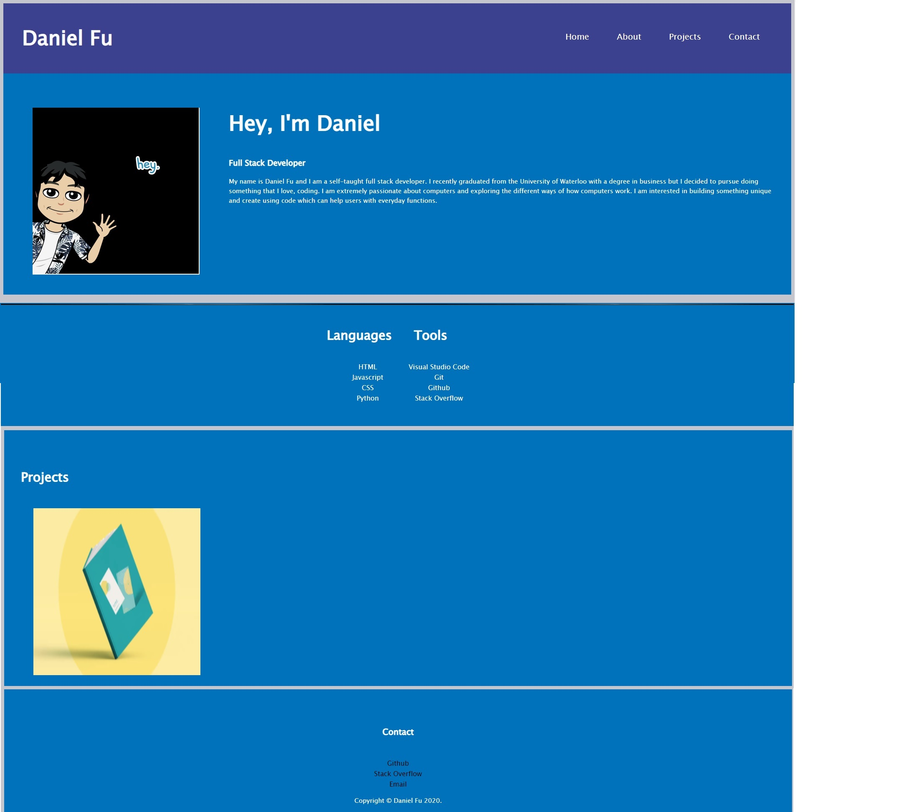

# Module 2 Challenge

## About the Challenge
The main purpose of this challenge was to follow our user's story and fulfill the factors on the acceptance criteria. The task was to create a self-portfolio, where we would present viewers with our name, a recent photo or avatar, and links to sections about me, my work, and how to contact me. There were also many other acceptance criterias, such as working links and an IU that scrolls down based on the navigation links.

## Daniel Fu Portfolio

    

